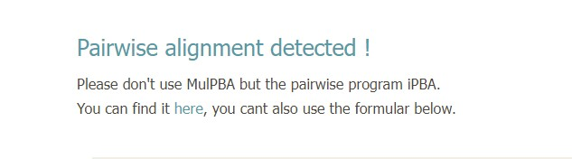
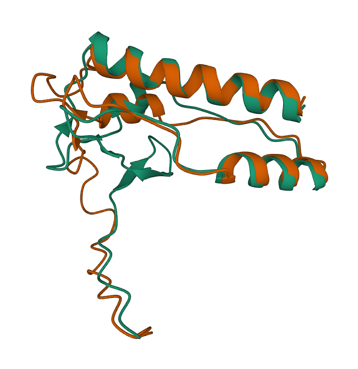
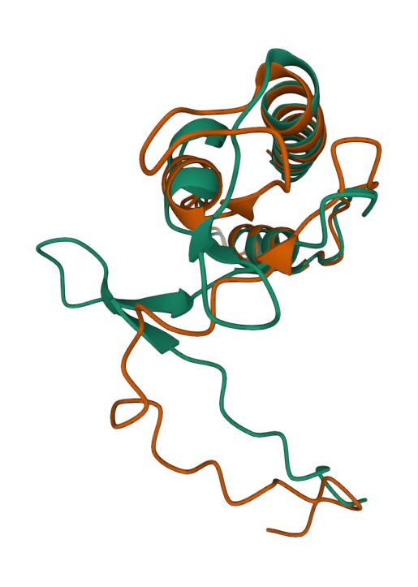
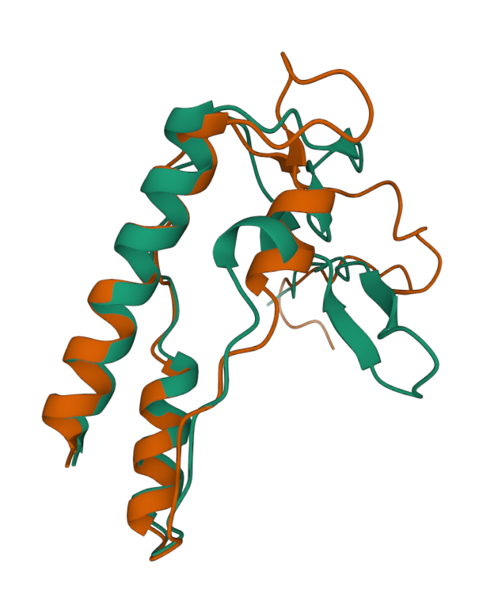

# nsu-bioinformatics-protein-prediction

#### Последовательность:
MDKGDVTALPMKKWFTTNYHYLVPEVEPSAEIKLNSTKPFDEFNEAKSLGVETKPVFIGPYTFLKLARTPEAAELEIDKGLVNAVAAVYAEVLARFNDLG
#### Программы предсказатели:
[AlphaFold2](https://colab.research.google.com/github/sokrypton/ColabFold/blob/main/AlphaFold2.ipynb)
[OmegaFold](https://colab.research.google.com/github/aqlaboratory/openfold/blob/main/notebooks/OpenFold.ipynb)

#### Программа-выравниватель: [mulPBA](https://www.dsimb.inserm.fr/dsimb_tools/mulpba/)
на оффициальном сайте при попытке провести выравнивание двух файлов всплывает сообщение, что mulPBA не очень подходит для парного выравнивания и лучше это сделать на [другом](https://www.dsimb.inserm.fr/dsimb_tools/ipba/index.php) их сервере с аналогичным функционалом

### Результаты
1. Полученные ноутбуки с предсказанной структурой:
[alphaFold](./notebooks/Copy_of_AlphaFold2.ipynb)
[omegaFold](./notebooks/Copy_of_omegafold.ipynb)
2. Полученные предсказания структур в формате PDB
[alphaFold](./predictions/alphafold2.pdb)
[omegaFold](./predictions/omegafold.pdb)
3. Результаты программы выравнителя
[тык](./results)
4. Визуализация результатов в программе https://www.rcsb.org/3d-view/

5. Вывод:  
Видно, что предсказания довольно близки, но всё таки имеются некоторые отличия